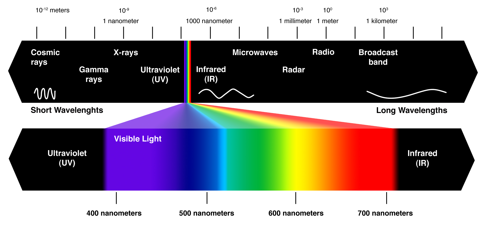
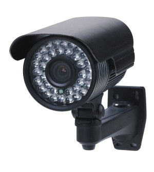

Infrared Bird Box
=================

A bird box with a Raspberry Pi infra red camera inside

This project will not only teach you about electronics and programming but can help support the bird population in your area.  Having a camera inside a nesting box can be tremendously rewarding, however with the Raspberry Pi you can share the nesting box with the world by video streaming the content to the Internet.  Watch as your birds gain their own Internet following!

This resource will walk you through the technical hurdles to allow you to have a working live webcam inside your bird box.  However it does not cover the DIY challenges required to protect your equipment from the elements.  Overcoming those is your own responsibility and will be quite a fun and motivating activity in its own right.

##Lesson objective
* place holder

##Lesson outcome
*	place holder

##Time
*	2-3 hours

##Requirements
*	Raspberry Pi
*	Micro USB power adapter
*	An SD Card with Raspbian already set up through NOOBS
*	USB Keyboard
*	USB Mouse
*	HDMI cable
*	Ethernet cable
*	LAN with Internet connection
*	A Monitor or TV
*	Raspberry Pi NoIR Camera Board - has a **black** circuit board (try [CPC](http://cpc.farnell.com/jsp/search/productdetail.jsp?sku=SC13223 "RPI NOIR CAMERA BOARD - RASPBERRY-PI"))
*	**Female** to **Female** jumper wires, at least 3 (try [Pimoroni](http://shop.pimoroni.com/collections/components "Components - Pimoroni"))
*	220 Ohm Resistor, get several in case of breakages (try [Pimoroni](http://shop.pimoroni.com/collections/components "Components - Pimoroni"))
*	Infrared LED 5mm 890nm, get several in case of breakages (try [RS](http://uk.rs-online.com/web/p/ir-leds/6997663/ "Buy IR LEDs Infrared LED 5mm 890nm"))
* Bird Box (try [B&Q](http://www.diy.com/nav/garden/pet-bird-care/bird-care/nesting_boxes/Gardman-Wild-Bird-Nest-Box-9374965 "Gardman Wild Bird Nest Box"))

##Optional extras
If you want to be able to turn the Infrared LED on and off in code.
* ULN2003 Transistor Array (try [RS](http://uk.rs-online.com/web/p/darlington-transistors/6868209 "Buy Darlington Transistors ULN2003"))
* Breadboard (try [Pimoroni](http://shop.pimoroni.com/products/solderless-breadboard-830-point "Solderless Breadboard - 830 point - Pimoroni"))
*	**Male** to **Female** jumper wires, at least 3 (try [Pimoroni](http://shop.pimoroni.com/collections/components "Components - Pimoroni"))

##Introduction

To begin with pupils should appreciate that garden birds are very choosy about where they build their nest.  The bird box will need to be located out of any predator's reach, away from any prevailing winds and nowhere near a bird table or feeder.

Once a bird has moved in the box must not be disturbed until they have finished breeding (usually between October and January in the UK).  If something goes wrong you can't just open the box and fiddle with your wires or adjust the camera as this will traumatise the birds and could cause eggs or hatchlings to be abandoned.

A requirement of the camera is to see the birds in total darkness.  A light inside the bird box could attract insects and predators and therefore no birds would chose it as a nesting site.  It is possible though to illuminate the inside of the bird box with a kind of light that is invisible to birds and humans but *is* visible to a camera. This is commonly known as night vision.  Night vision works by using a spectrum of light called [Infrared](http://en.wikipedia.org/wiki/Infrared "Infrared - Wikipedia, the free encyclopedia") which has a longer wavelength than visible light.  Notice that IR is to the right hand side of the visible spectrum of light below.

Take this night vision surveillance camera for example.  Around the camera lens there are lots of infrared LEDs (light emitting diode).  These emit infrared light which then bounces off various objects and then returns to the camera lens allowing it to form an image.

The image will look black and white (greyscale) though because there are no wavelengths of light from the visible spectrum being detected.  However a black and white image is good enough to allow you to watch what is happening inside a bird box!
