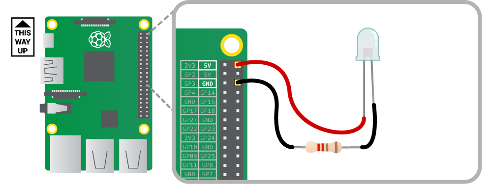
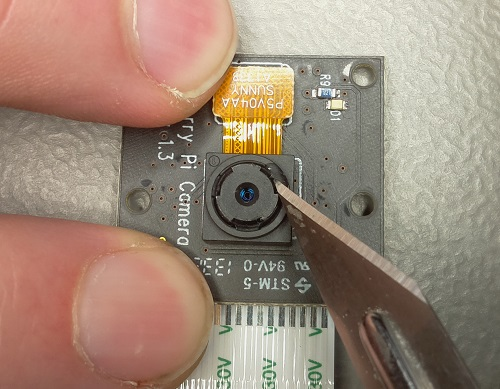
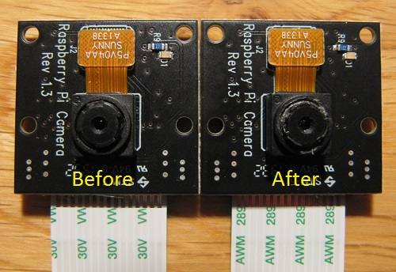
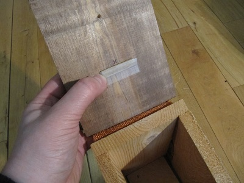
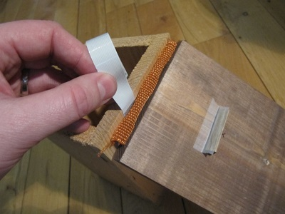
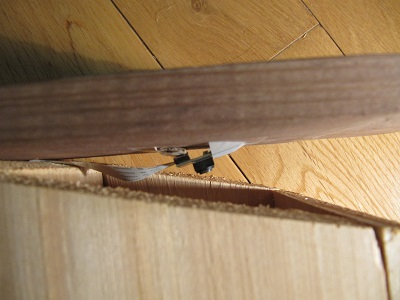
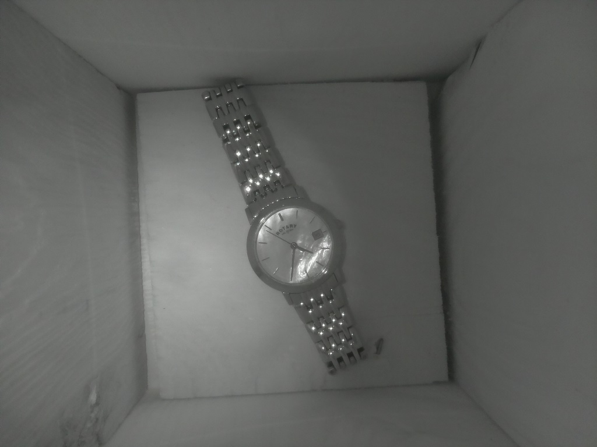

# Infrared Bird Box

In this project, you will use a Raspberry Pi and a Pi NoIR camera to allow you to observe nesting birds without disturbing them. 

## Why use the Pi NoIR? 

Garden birds are very choosy about where they build their nest. In order to get good results from this activity, the bird box will need to be located out of the reach of predators, away from any prevailing winds, and nowhere near a bird table or feeder.

Once birds have moved in, the box must not be disturbed until they have finished breeding; this is usually between October and January in the UK. If something goes wrong with the project, you can't simply open the box and fiddle with your wires or adjust the camera, as this will traumatise the birds and could cause eggs or hatchlings to be abandoned.

A requirement of the system is to be able to see the birds in total darkness. A light inside the bird box could attract insects and predators, and therefore no birds would select it as a nesting site. It is possible, however, to illuminate the inside of the bird box with a kind of light that is invisible to animals and humans, but is visible to a camera. This is commonly known as night vision. Night vision works by using a spectrum of light called [infrared](http://en.wikipedia.org/wiki/Infrared) which has a longer wavelength than visible light. Notice that IR is to the right hand side of the visible spectrum of light below:


Look at the night vision surveillance camera below, for example. Around the camera lens, there are lots of infrared LEDs (light-emitting diodes). These emit infrared light which will then bounce off various objects and return to the camera lens, allowing it to create an image.


The image will look black and white (greyscale) because there are no wavelengths of light from the visible spectrum being detected. However, a black and white image is good enough to allow you to watch what is happening inside a bird box, and it doesn't disturb or interfere with the birds in any way.


Pictured above is the special version of the Raspberry Pi camera board called Pi NoIR. It's essentially identical to the normal green camera but it has no infrared filter, meaning that it lets in infrared light. This camera, combined with an infrared light source, will give you night vision. It's also small and won't be too intrusive when mounted on the inside of a bird box.

## Setting up the Camera Board

Firstly, set the Pi NoIR camera board up and test it, without fitting it to the bird box: we will come to that part later. Follow the instructions [here](http://www.raspberrypi.org/camera) and stop once you have successfully used a few of the example commands.

If you have not done so already you can test the camera video preview using the following command:

```bash
raspivid -t 0
```

You'll notice that everything looks a little strange. This is because you're looking at a combination of visible light and infrared light. A quick test is to turn the lights off, aim a TV remote control at your face and press the buttons. You should see your face illuminated in the darkness.

Press `Ctrl + C` when you want to exit.

## Wiring up the infrared LED

The intention is to have a single infrared LED illuminating the inside of the bird box, to allow the Pi NoIR camera to see something. The 890nm IR LED is an identical component to the ones found inside TV remote controls. The only difference is that we're going to keep it on constantly to facilitate the live stream.

You should wire the LED up with the Raspberry Pi turned off and unplugged from the mains for safety. Use the following command to shut down the Pi:

```bash
sudo halt
```

Wait for the ACT (activity) LED to stop blinking before turning off the power.

If you've wired up an LED to the Pi GPIO pins before, then please note that this LED needs to be done slightly differently. An infrared LED requires more current than the GPIO pins can provide. It needs to be connected directly to the 5 volt supply of the Raspberry Pi with a 220 ohm resistor inline; without the resistor the current will be too high, and the LED will burn out after about ten seconds.

Ensure that you have the correct type of resistor; it needs to be 220 ohms, **not** 220K ohms. The 5 band resistor colour code is red - red - black - black - brown. Please refer to the [electronic colour code](http://en.wikipedia.org/wiki/Electronic_color_code) system for further guidance. This is what the resistor should look like:


The diagram below shows how the LED should be wired up. You'll notice that the LED has two legs, one slightly longer than the other. The longer of the two is called the **anode** and the shorter is the **cathode**. The LED needs power to flow into the anode and out of the cathode; if you get the polarity wrong then nothing will happen.

Use the female to female jumper wires to make the following connections:

- Connect the anode (long leg) to 5 volts, which is the first pin on the outside row on the Pi
- Connect the cathode (short leg) to the 220 ohm resistor
- Connect the other side of the resistor to ground, which is the third pin in on the outside on the Pi

This will allow power to flow from the Pi into the LED and back to ground through the resistor. The resistor will limit the current to about 23 mA so that the LED doesn't burn out.



Next, turn the Raspberry Pi back on and log in as usual. You'll quickly notice that the LED doesn't appear to be working, but in fact it is. Your human eyes can't see it, but the Pi NoIR camera can. Turn on the camera preview with this command:

```bash
raspivid -t 0
```

Hold the LED in front of the camera and it will look like this:


If the LED still does not appear to be lit then you may have mixed up the polarity of the anode and cathode. Double-check your wiring against the diagram above. Try turning out the lights and aiming the LED at yourself; don't look directly into it, however, as infrared light can still cause harm to your eyes. You'll see from the Pi NoIR camera preview that it will illuminate you quite well.

Press `Ctrl + C` when you want to exit.

## Adjusting the camera focus

Bird boxes tend to be quite small, and because of this you will probably need to reduce the focal length on the Pi NoIR camera; otherwise you're only going to see blurry images of birds. It will depend on the bird box you have chosen; however if you're using the [Gardman](http://www.diy.com/nav/garden/pet-bird-care/bird-care/nesting_boxes/Gardman-Wild-Bird-Nest-Box-9374965) box suggested by this guide (which is also recommended by [British Trust for Ornithology](http://www.bto.org/)) then you will definitely have to adjust the camera focus.


The focal length of the camera is the distance from the front of the lens to the closest object which is in focus. The depth of field is the range within which objects appear to be in focus.

The Pi camera board has a focal length of about 50 cm and a depth of field of 50 cm to infinity. This means that objects will only appear in focus if they’re at least 50 cm away from the lens of the camera. If objects are closer then they will be blurry and out of focus. The Gardman bird box is about 18 cm high on the inside; therefore we know that if the camera is stuck to the inside of the roof, all objects are going to be 18 cm or closer. If we want them to be in focus then the camera focal length will need to be reduced.

As an experiment try putting some car keys into the bird box and, with the roof open (remove the screw), hold the camera at the approximate height of the roof and look at the camera preview. The keys will probably not be in focus. Use the following command to start the camera preview:

```bash
raspivid -t 0
```

Press `Ctrl + C` when you want to exit.

The Raspberry Pi NoIR camera has a lens that can rotate to adjust the focus. It is sold as a fixed focus camera, but it ships with three blobs of glue to hold the rotatable lens in place. Look at the image below: the letters **A**, **B** and **C** mark the location of the glue:


To be able to rotate the lens to adjust the focus, you will need to dig out these blobs of glue manually. This is easier than it sounds and only takes about five minutes. You will need a sharp tool like a needle, a scalpel or a dental pick. Doing the work under a low powered microscope can also help a lot. You should completely disconnect the camera from the Raspberry Pi when you do this.



Take care not to cut your fingers. Children should only do this under adult supervision for safety, especially if a scalpel is being used. The orange connector with the word `SUNNY` printed on it can pop out when you are scraping the glue away; don’t worry though, because it pops right back in without any problems. Unless you’re overly heavy-handed, it’s unlikely that you will break the camera; if it does break then it’s your own responsibility.

The camera will end up looking a little scruffy after you have removed the glue, but it doesn't really matter since it's going to live on the inside of a bird box without anyone looking at it. See below for a comparison:



Once you're satisfied that you have removed all of the glue, use a pair of tweezers or jewellery pliers to grip the inner section of the camera as shown below; you should then be able to turn it. Carefully rotate it **anti-clockwise** a few times. Now reconnect the camera to the Raspberry Pi and check to see how the keys look.

You may wish to put something under the keys at this point to simulate the height of a nest, to make doubly sure that the birds will be in focus. Remember that once birds move in, you can't come back and adjust the camera if the focus is wrong.


Be careful not to rotate the lens too far, otherwise it will pop out, and it can be a bit tricky to get it back in and on the thread. If this does happen, just put it back in gently and rotate clockwise until it catches. Once the required focus has been found you don't need to re-glue it. It won't move on its own even if it gets a few bumps and knocks.

## Installing the camera and LED into the bird box

In this part of the guide, we will demonstrate what has to be achieved by installing the camera; it will then be up to you to come up with a more permanent solution, which is a fun group activity in itself.

The following instructions are for the [Gardman](http://www.diy.com/nav/garden/pet-bird-care/bird-care/nesting_boxes/Gardman-Wild-Bird-Nest-Box-9374965) bird box.

1. Place your finger on the roof approximately above the centre of the main body of the bird box.

    

2. Lift up the roof and place your thumb directly below your finger so that you're pinching the lid as shown.

    

3. Your thumb is now where the camera needs to be. Take a pen and mark this spot with a cross.

    

4. Cut out a rectangle of cardboard approximately 4 cm x 2 cm (1.5" x 0.75") and fold it in half lengthways. Use some tape to secure it to the underside of the roof so that it's a few millimetres below the cross. This is going to be used to compensate for the angle of the roof, so that the camera board points directly into the middle of the bird box.

    

5. Next, take the Pi NoIR camera board and slide the flex down between the roof hinge and the back wall of the box. Do this with the tin connectors facing away from the back wall. If you wish you can remove the two middle staples holding the hinge in place; this will make the flex exit the bird box more neatly.

    

6. Take some tape and put it across the top of the Pi NoIR camera board as shown. Do **not** cover the camera lens.

    

7. Secure the camera in place so that the central lens is directly over the cross that you drew earlier. The camera should sit at an angle.

    

8. Close the lid and inspect the camera angle from the side: it needs to point directly at the centre of the base. If it doesn't look right, then go back and adjust it until you're happy.

    

9. Secure the infrared LED to the underside of the roof. Don't attach it too close to the camera, or you'll see a lot of glare on the video. The LED can go anywhere, but it can help to bend its legs by 90 degrees as shown and secure it to the roof that way. You may also wish to blank off the end of the LED with correction fluid or by filing it down with a nail file. This will prevent any spotlight effect on the video and give a more diffuse light.

    

10. Now reconnect the Raspberry Pi and test the focus once again. I recommend connecting the camera flex coming from the back of the bird box to the Pi first. Then connect the LED and resistor, followed by the screen, keyboard, and finally the power supply. When testing this setup, it can be helpful to rest the Raspberry Pi upside down on the roof of the bird box, but do whatever works best for you.

11. Boot up, log in as usual and then start the video preview with `raspivid -t 0`. With the roof of the bird box closed, you should be able to see the inside in black and white. This shows that the infrared illumination is working; you should even be able to cover the hole and still see the inside. It will look similar to the picture below but will be slightly more zoomed in. This is because this image was taken using the `raspistill` command and not `raspivid`. If you can't see anything at all then it's likely the LED is not wired up correctly: double-check the wiring and the polarity of the anode and cathode.

    

12. It is now helpful to put an object with some black-on-white text into the bird box to verify the focus; a good object to use would be a watch or a business card. Ensure that the text is in focus and readable; adjust the camera focus again as necessary before continuing. Remember to compensate for the nest height.

    Press `Ctrl + C` when you want to stop the camera preview.

13. Lastly, consider the red LED on the camera board. By default, it comes on whenever the camera is on. This will be a huge deterrent to birds moving in, so you should disable it. This can be done by editing the Raspberry Pi configuration file. Enter the command below:

    ```bash
    sudo nano /boot/config.txt
    ```

    Add the following line to the end of the file:

    ```bash
    disable_camera_led=1
    ```

    Press `Ctrl + O` to save and `Ctrl + X` to quit. The changes will only take effect after a reboot:

    ```bash
    sudo reboot
    ```

## What next?

Here are some ideas for making the installation more permanent and protecting it from the elements. Whether you choose to follow them is up to you.

- If you are using the Gardman bird box, do not trust the keyhole mount on the back. This mount supports the entire weight of the bird box on a single thin piece of wood. It is better to drill through from the inside and mount it using a large screw and washer. 

- Consider that the Raspberry Pi does not need to be directly attached to the bird box itself. You can buy a [replacement camera cable](http://shop.pimoroni.com/products/raspberry-pi-camera-cable) which can give you greater range. The same connector found on the Raspberry Pi itself is also found on the back of the camera board, allowing you to easily change it (the tin connectors face the same side as the lens).

- The Raspberry Pi could be placed inside a plastic box to waterproof it; it should not be a problem to close the camera flex into the lid. Choosing a site which is beneath the overhang of an existing roof will help a lot, so the bird box will not be rained on directly.

- How will you get power and an Internet connection to the bird box? You could use a wireless USB dongle but Ethernet is more reliable for streaming video, especially in built-up areas that have a lot of wireless traffic.

- Preventing water getting into the box should be a priority. The roof could be sealed using silicone sealant, which is often used to seal the edges of windows and bathroom sinks.

- Try to make use of the four mounting holes on the camera board. Perhaps you could jigsaw a wedge of wood to keep it at the right angle, and put screws through to hold it in place.

- What other uses can you think of for an infrared camera and LED?

- You could try following this [advanced worksheet](worksheet2.md) to stream your bird box live on the Internet.

